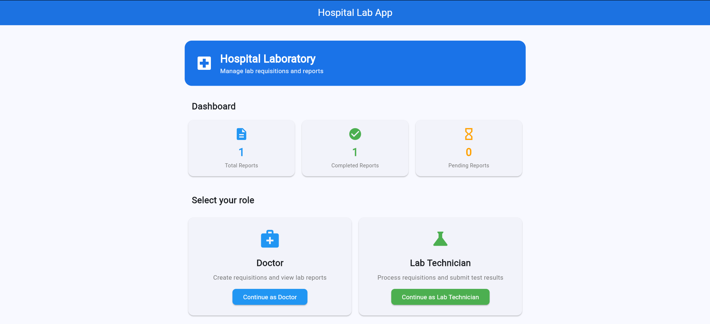
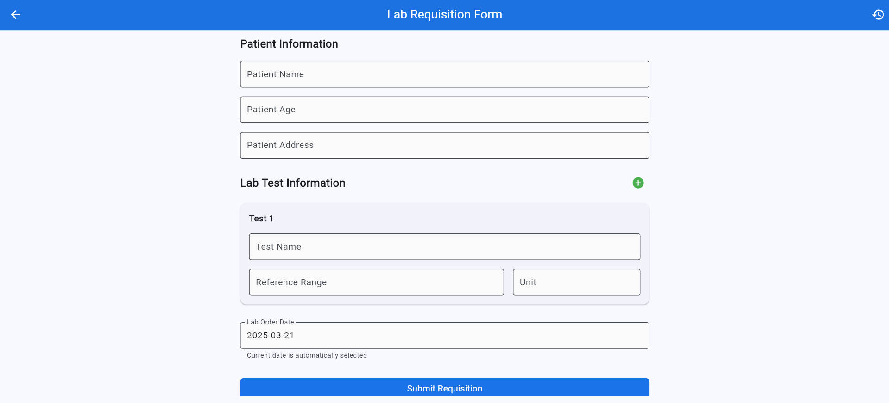
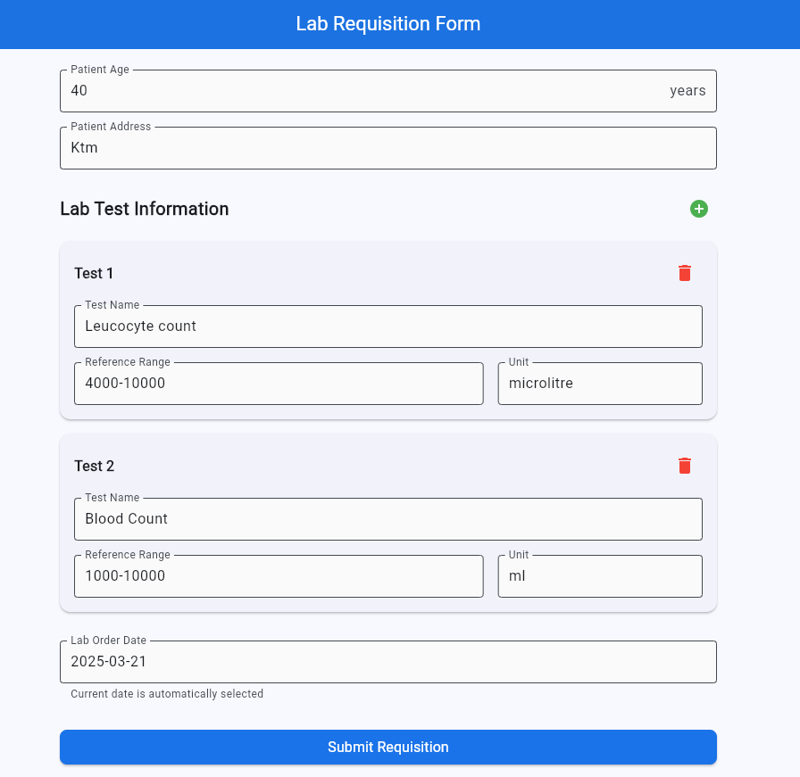
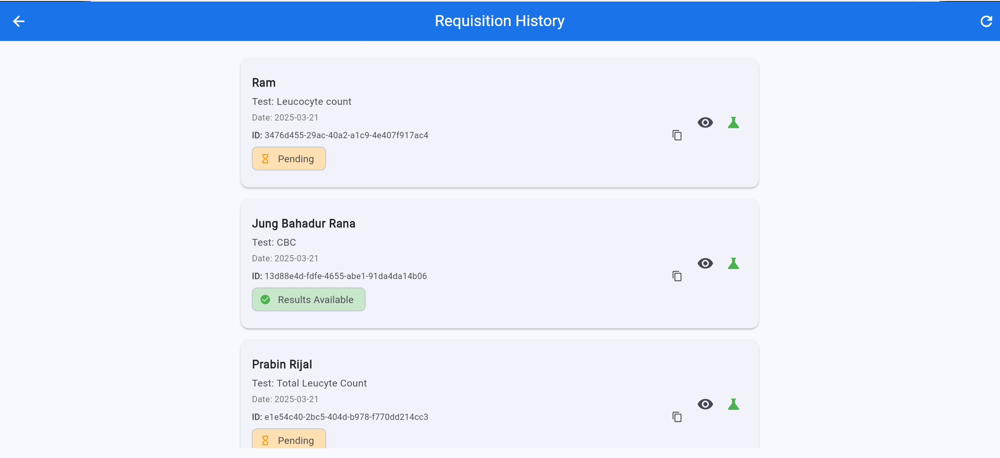
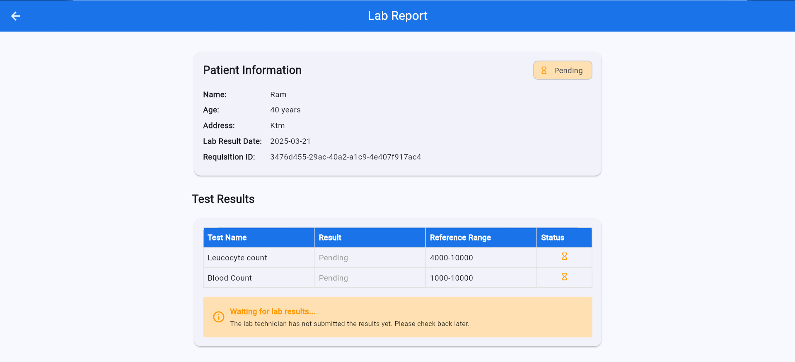
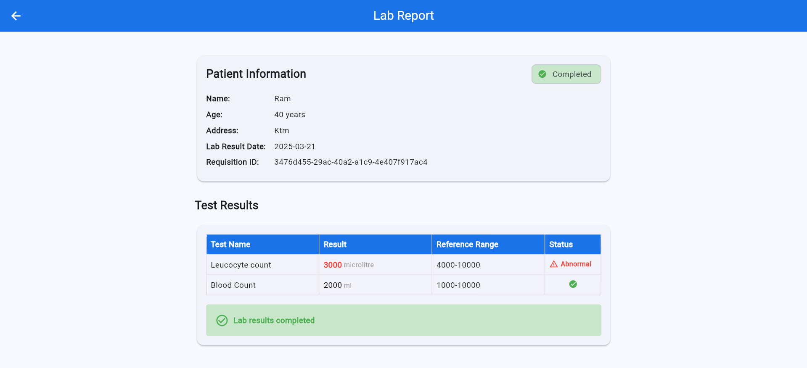
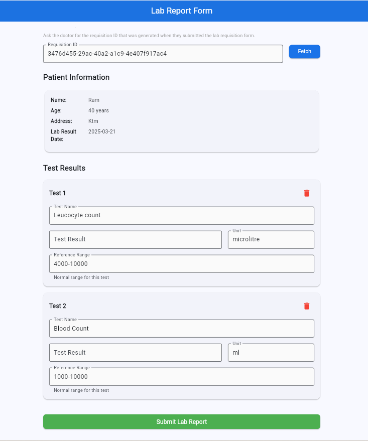

# Hospital Lab App

A Flutter application for managing laboratory requisitions and reports in a hospital setting. This app streamlines the workflow between doctors and laboratory technicians, making it easier to request lab tests, record results, and view completed reports.

## Table of Contents

- [Overview](#overview)
- [Features](#features)
- [Screenshots](#screenshots)
- [Architecture](#architecture)

## Overview

The Hospital Lab App facilitates the complete workflow of laboratory testing in a hospital environment:

1. Doctors create lab test requisitions for patients
2. Lab technicians receive the requisitions and enter test results
3. Doctors view the completed lab reports with test results

The application is designed with a clean, intuitive interface and follows best practices for Flutter development, including a robust architecture pattern and state management.

## Features

### For Doctors

- Create lab requisitions with patient information
- Add multiple lab tests with reference ranges
- View requisition history
- Track the status of lab reports (pending or completed)
- View detailed lab reports with test results and abnormal indicators

### For Lab Technicians

- Fetch requisitions using the requisition ID
- Enter test results for multiple tests
- Submit completed lab reports
- View patient information

### General Features

- Role-based access (Doctor or Lab Technician)
- Dashboard with statistics
- Responsive design for various screen sizes
- Offline data persistence

## Screenshots

### Role Selection Screen

![Role Selection] 

### Doctor's Requisition Form

![Doctor Requisition] 
![Doctor Requisition 1] 

### Requisition History

![Requisition History] 

### Lab Report View (Doctor)

![Pending Report View] 
![Report Result View] 

### Lab Report Form (Technician)

![Lab Report Form] 

## Architecture

The app follows the Clean Architecture pattern with BLoC for state management:

### Layers

1. **Presentation Layer**

   - Pages (UI)
   - Widgets (Reusable UI components)
   - BLoCs (Business Logic Components)

2. **Domain Layer**

   - Entities (Core business objects)
   - Repositories (Interfaces)
   - Use Cases (Business logic)

3. **Data Layer**
   - Models (Data representations of entities)
   - Repositories (Implementations)
   - Data Sources (Local and remote)

### State Management

- Flutter BLoC for managing application state
- Events, States, and BLoCs for each feature

### Dependency Injection

- GetIt for service locator pattern
- Lazy initialization of dependencies

### Installation

1. Clone the repository:
   git clone https://github.com/prabinrijal03/hospital_lab_app.git
